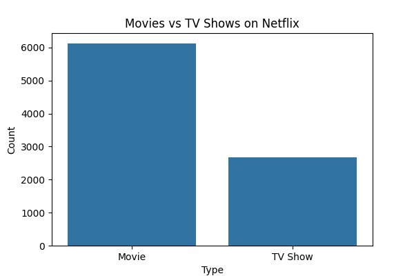
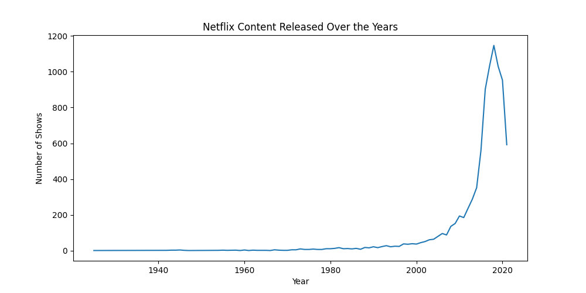
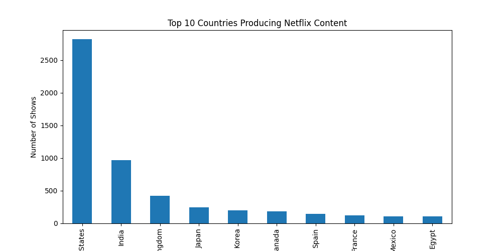
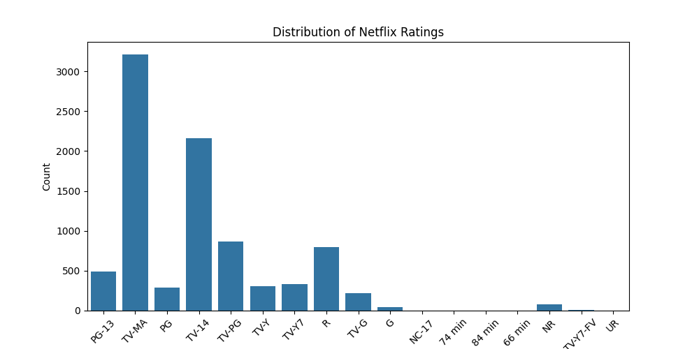
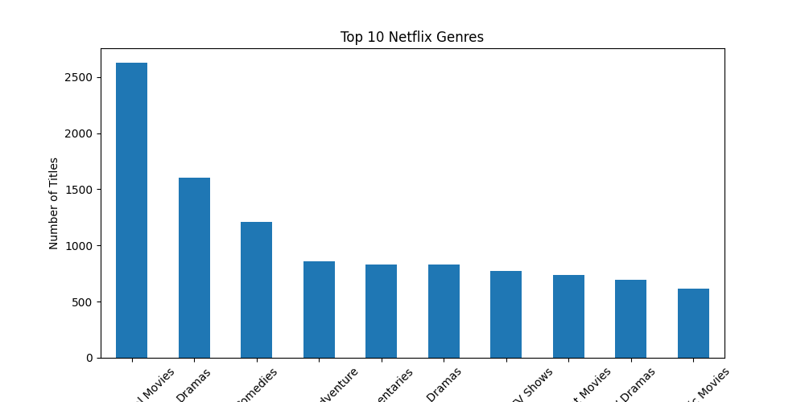

# Netflix Data Analysis

This project analyzes Netflix movies and TV shows using Python.

## Objectives
- Compare Movies vs TV Shows
- Analyze Netflix content growth over years
- Identify top countries producing Netflix content
- Study rating distribution

## Technologies Used
- Python
- Pandas
- Matplotlib
- Seaborn

## Project Files
- analysis.py : Python script for data analysis
- netflix_titles.csv : Dataset
- movies_vs_tvshows.png : Chart showing Movies vs TV Shows
- content_by_year.png : Netflix content growth chart
- top_countries.png : Top producing countries
- ratings_distribution.png : Ratings analysis

## Visualizations

### Movies vs TV Shows

### Netflix Content by Year

### Top Countries Producing Content

### Ratings Distribution

### Top Netflix Genres
